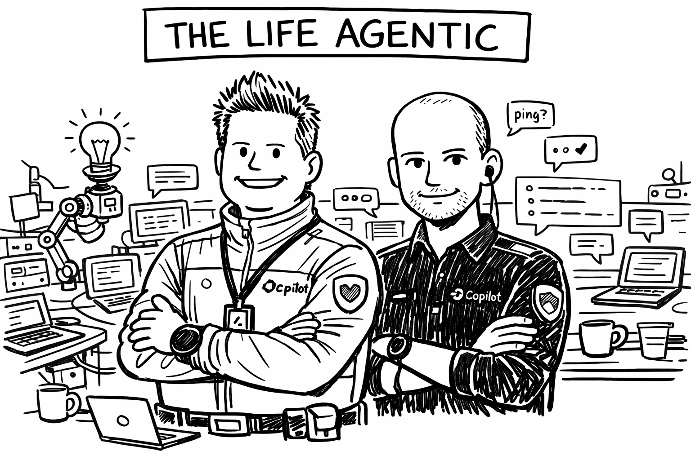

# introagents

An introduction to using LLMs as tools.

## Start here

### [Students](students/)

Practical guides for GitHub student benefits, model access, Claude Code, skills, `AGENTS.md`, Copilot, OpenCode, and the Python package `llm`.

### [TCS](tcs/)

Staff-oriented material on AI tool use in TCS, plus a link to the LaTeX source in the repository.
