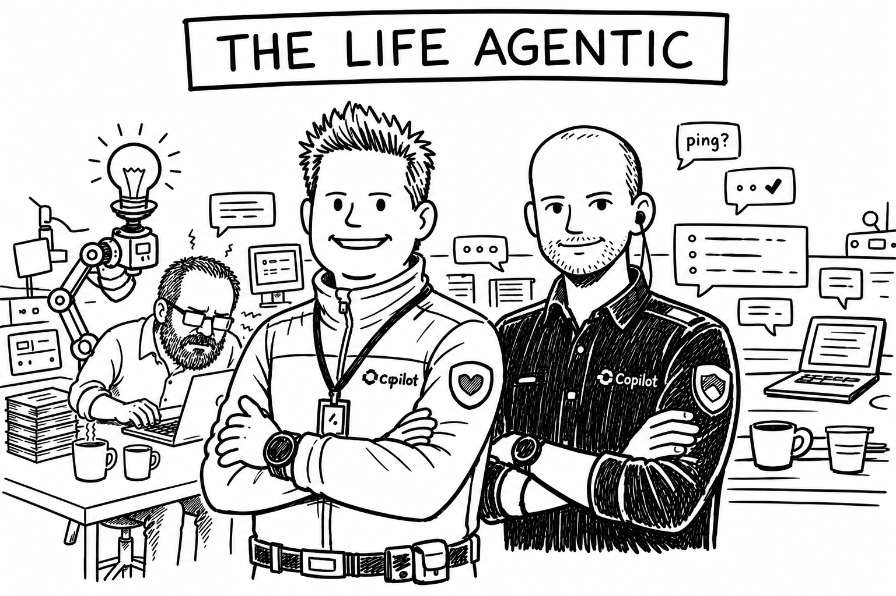

# introagents

An introduction to using LLMs as tools.

## Upcoming event

### [Student Life Agentic on 2026-05-20, 09:15](students/event.html)

We will work through how to use the agentic way of working to aid life as a 
student.
In essence, we'll illustrate agentic engineering by showing how to use it to 
streamline and improve your study efficiency.

## Start here

### [Students](students/)

Practical guides for GitHub student benefits, model access, local models and Ollama, Claude Code, skills, `AGENTS.md`, Copilot, OpenCode, and the Python package `llm`.

### [TCS](tcs/)

Staff-oriented material on AI tool use in TCS, plus a link to the LaTeX source in the repository.
