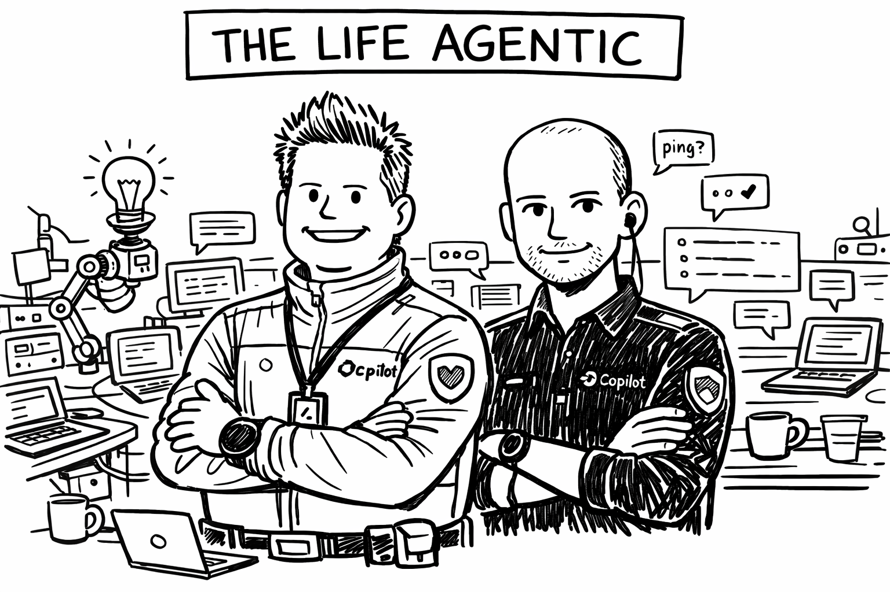

# Extracurricular workshop: Student Life Agentic

- **Date:** 2026-05-20 (Wednesday)
- **Time:** 09:15
- **Location:** D1, D37, E32 or https://kth-se.zoom.us/j/68711734309
- **Format:** Hybrid lecture/workshop
- **Duration:** Until we're satisfied, you can leave when you've gotten what 
  you need.

## What this event is about

Most students have by how tried something like ChatGPT. However, the vast 
majority have only interacted with LLMs through a web interface. That interface 
extremely limits the potential of LLMs. In this workshop, we will show you how 
to use LLMs in a more powerful way.

We will cover agentic use of LLMs. Particularly, we'll illustrate the agentic 
use of LLMs by showing how you can improve your study efficiency for the coming 
exam period.

## Who should come

Anyone who will work with computers in the future should attend. Anyone who has 
taken a course on introductory programming should be able to follow along.

## What to bring or prepare

You don't have to do anything before attending, you can just enjoy the show.
However, if you want to try and follow along with what we do (to save time 
later), you should bring a laptop and start to set up your environment, 
particularly register for the necessary accounts.
See [Model access](model-access.html) for an overview of the services you
can register for. We'll use GitHub Copilot and Claude Pro as examples.

## After the event

If you want to get started with the tools we cover in this course, see the
[student guide](./) for practical setup instructions on GitHub student
benefits, model access, Claude Code, Copilot CLI, OpenCode, skills,
`AGENTS.md`, and the Python `llm` package.

